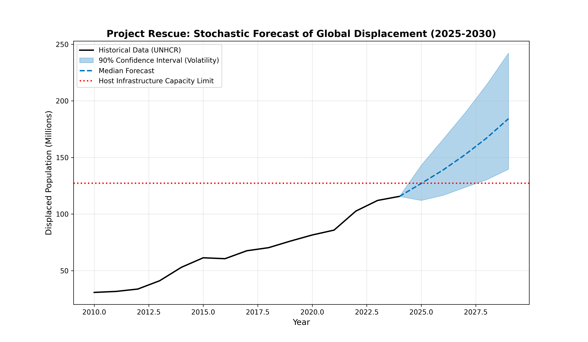

# Project Rescue: Stochastic Modeling for Anticipatory Humanitarian Action


## 🇺🇳 Abstract & Policy Motivation
The global refugee crisis is characterized by volatility. Traditional humanitarian planning often relies on retrospective analysis ("what happened last year"), which leaves agencies reactive rather than proactive.

**Project Rescue** shifts the operational paradigm from **Reactive Response** to **Anticipatory Intelligence**.

This tool utilizes **Stochastic Monte Carlo Simulations** to forecast future displacement corridors. By modeling geopolitical volatility as a random variable, it identifies the **"Critical Risk Zone"**—the specific timeframe where displacement flows are mathematically projected to overwhelm host country infrastructure (housing, medical capacity, and budget).

---

## 🧠 Methodology & Mathematical Framework
Unlike simple linear regressions that assume stability, this model treats displacement as a **Stochastic Process**. We model the population $N$ at time $t$ using a geometric random walk with drift.

### 1. The Stochastic Differential Equation
Future displacement is modeled as:

$$N_{t+1} = N_t \cdot e^{(\mu + \sigma \epsilon)}$$

Where:
* **$N_t$**: Current displaced population.
* **$\mu$ (Drift)**: The historical average growth momentum of the crisis corridor.
* **$\sigma$ (Volatility)**: The standard deviation of historical shocks (conflict flare-ups, policy changes).
* **$\epsilon$ (Noise)**: A random variable sampled from a Standard Normal Distribution $\mathcal{N}(0,1)$.

### 2. Monte Carlo Simulation
The engine executes **2,000 parallel simulations** ("random walks") into the future. This generates a probabilistic distribution of outcomes, allowing us to calculate the probability of crisis $P(\text{Crisis})$:

$$P(\text{Crisis}) = \frac{1}{M} \sum_{i=1}^{M} \mathbb{I}(N_i > K_{limit})$$

Where:
* **$M$**: Total number of simulations (2,000 iterations).
* **$K_{limit}$**: The host country's infrastructure capacity threshold.
* **$\mathbb{I}$**: An indicator function that equals 1 if the population exceeds capacity, 0 otherwise.

---

## 📊 Visual Analysis: The "Cone of Uncertainty"
### Research Question
*Can we quantify the probability of a humanitarian system collapse 5 years in advance?*

### Forecast Model Output


*Figure 1: The **Cone of Uncertainty**. The blue shaded region represents the 90% confidence interval for future displacement, accounting for historical volatility (σ). The red dotted line marks a hypothetical **Capacity Threshold** (K_limit), signaling the point where resource demand exceeds supply.*

**Key Insight:** The model does not just predict a single number; it visualizes the **Range of Risk**. The intersection of the *Upper Confidence Bound* and the *Red Threshold* serves as an **Early Warning Signal (EWS)** for policymakers.

---

## 📂 Repository Structure
| File Name | Description |
| :--- | :--- |
| `refugee_displacement_analysis.py` | **Core Engine.** Python script handling data ingestion, volatility calculation, and stochastic plotting. |
| `persons_of_concern.csv` | **Source Data.** Historical UNHCR statistics used to calibrate the drift ($\mu$) and volatility ($\sigma$) parameters. |
| `displacement_forecast_model.png` | **Output.** The generated visualization demonstrating the Cone of Uncertainty. |
| `requirements.txt` | **Dependencies.** Lightweight environment using `numpy` and `pandas`. |

---

## 🚀 Usage Instructions

### Prerequisites
* Python 3.8+
* `pip` package manager

### Setup & Execution
1.  **Clone the repository:**
    ```bash
    git clone https://github.com/PradyumnShirsath/unhcr-refugee-analysis.git
    ```

2.  **Install dependencies:**
    ```bash
    pip install -r requirements.txt
    ```

3.  **Run the Simulation:**
    ```bash
    python refugee_displacement_analysis.py
    ```
    *The script will automatically detect relevant data columns, run 2,000 simulations, and generate `displacement_forecast_model.png`.*

---
*Author: Pradyumn Shirsath | Developed for Humanitarian Data Analysis & Crisis Response*